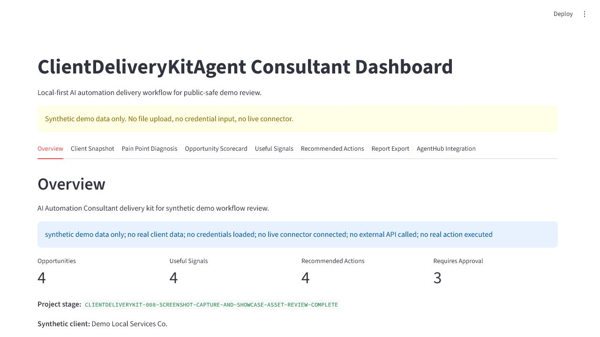
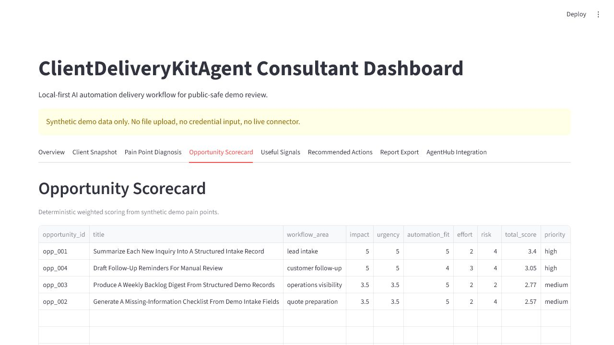
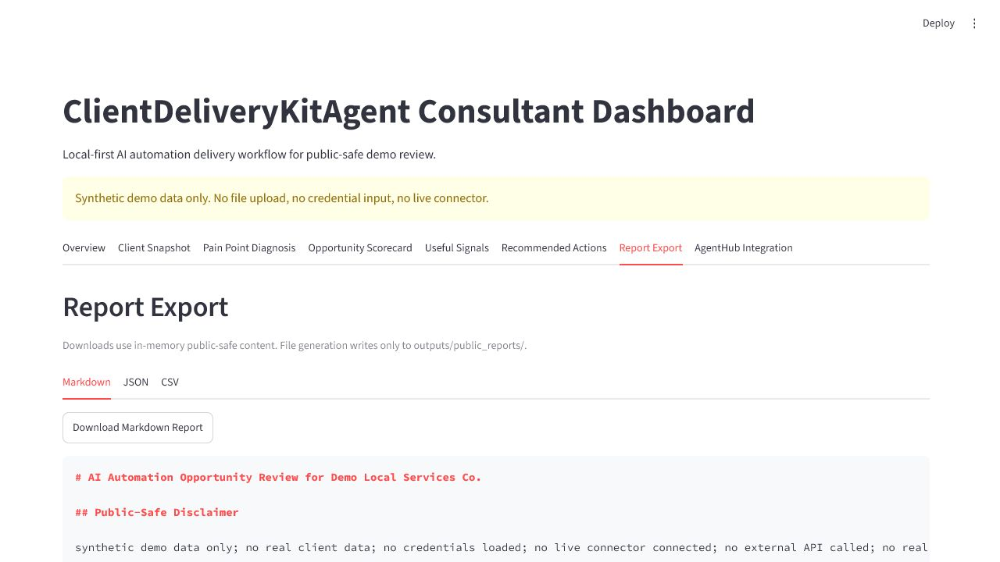

# ClientDeliveryKitAgent

**AI Automation Consultant Delivery Kit**

ClientDeliveryKitAgent is a client-facing workflow demo for turning synthetic
client intake into pain point diagnosis, automation opportunity scorecards,
useful signals, recommended actions, and public-safe delivery reports.

It is local-first, synthetic demo-only, and public-safe. It does not process
real client data, connect real connectors, collect credentials, upload files, or
execute real automation actions. The project is managed as a local spoke through
AgentHubControlCenter and can be opened locally at:

```text
http://localhost:8535
```

## Current Stage

- Checkpoint: `CLIENTDELIVERYKIT-011-PROFILE-PIN-OR-MAINTAIN-SHOWCASE-DECISION-COMPLETE`
- Mode: local demo scoring, public-safe report export, and Streamlit dashboard
- Data: synthetic demo data only
- Execution: local dashboard view, object generation, and public-safe local report export only; no real automation actions
- Connector status: planned only
- GitHub status: live public showcase verified at `https://github.com/CHENXJC/ClientDeliveryKitAgent`
- Portfolio status: `recommend pin` if a GitHub profile slot is available; otherwise maintain showcase as an AgentHub spoke

## Positioning

This project fills the portfolio gap between technical AgentOps dashboards and practical client delivery materials. It is intended to show how a business-oriented AI automation consultant can structure intake, diagnose operational pain, score automation opportunities, and prepare a public-safe delivery report.

## MVP Workflow

1. Client Intake
2. Business Context Extraction
3. Pain Point Diagnosis
4. Workflow Bottleneck Mapping
5. Automation Opportunity Scoring
6. Useful Signals
7. Recommended Actions
8. Delivery Report / Proposal Summary
9. AgentHubControlCenter Integration

## Planned Core Modules

- `client_intake`: represented by `ClientIntake`
- `business_context`: represented by `BusinessContext`
- `pain_point_diagnosis`: implemented in `client_delivery_kit/pain_point_engine.py`
- `workflow_mapping`: represented through pain point workflow areas
- `automation_opportunity_scoring`: implemented in `client_delivery_kit/scoring_engine.py`
- `useful_signals`: implemented in `client_delivery_kit/useful_signals.py`
- `recommendation_engine`: implemented in `client_delivery_kit/recommendation_engine.py`
- `delivery_report_builder`: implemented in `client_delivery_kit/report_builder.py`
- `streamlit_dashboard`: implemented in `app.py` and `client_delivery_kit/dashboard_views.py`
- `agenthub_export`: currently summary object only
- `connector_readiness`: planned only

## Current Demo Engine

`CLIENTDELIVERYKIT-002` adds a deterministic local scoring engine that can:

- load synthetic JSON samples from `sample_data/`
- validate demo-only client intake, business context, and workflow pain points
- diagnose workflow bottlenecks
- score automation opportunities using transparent weighted rules
- produce AgentHub-ready useful signal objects
- produce text-only recommended action objects
- build a public-safe delivery summary object without writing a full report

## Public-Safe Report Export

`CLIENTDELIVERYKIT-003` adds a report builder that converts the demo `DeliverySummary` into:

- Markdown report: `outputs/public_reports/clientdeliverykit_demo_report.md`
- JSON report: `outputs/public_reports/clientdeliverykit_demo_report.json`
- CSV scorecard: `outputs/public_reports/clientdeliverykit_opportunity_scorecard.csv`

All report artifacts include public-safe disclaimers and are generated only from synthetic demo data. The exporter rejects paths outside `outputs/public_reports/`, rejects `outputs/private/`, and does not connect external systems.

## Consultant Dashboard

`CLIENTDELIVERYKIT-004` adds a local Streamlit dashboard at:

```text
http://localhost:8535
```

The dashboard shows Overview, Client Snapshot, Pain Point Diagnosis, Opportunity Scorecard, Useful Signals, Recommended Actions, Report Export, and AgentHub Integration. It does not provide file upload, credential input, OAuth, real connector, or real action execution.

## Dashboard Preview

Public showcase screenshots are captured under `docs/images/`. Representative
README preview images:







Full screenshot inventory:

- `01_dashboard_overview.png`
- `02_client_snapshot.png`
- `03_pain_point_diagnosis.png`
- `04_opportunity_scorecard.png`
- `05_useful_signals.png`
- `06_recommended_actions.png`
- `07_report_export.png`
- `08_agenthub_integration.png`

Screenshots must use the synthetic dashboard only and must not show terminal
secrets, private outputs, credential forms, or real customer data.

## First Deliverables

- Discovery summary
- Client pain point map
- Automation opportunity scorecard
- Recommended workflow improvements
- Risk and approval notes
- Suggested next steps
- Public-safe delivery report template

## AgentHub Integration

The project is discoverable by AgentHubControlCenter through `agent_manifest.json`. Future outputs should be convertible into useful signals, Action Center cards, report export sections, and connector readiness reviews.

All future real send, write, customer-data, or external-system actions must pass a connector readiness review and an approval gate before implementation.

## Managed Through AgentHubControlCenter

ClientDeliveryKitAgent is now a local AgentHub spoke project. AgentHubControlCenter discovers this project through:

```text
F:\AIProjects\ClientDeliveryKitAgent\agent_manifest.json
```

Current AgentHub status:

- Manifest status: valid local manifest
- Role in AgentHub: client-facing delivery workflow spoke
- Dashboard URL: `http://localhost:8535`
- GitHub status: live public showcase verified at `https://github.com/CHENXJC/ClientDeliveryKitAgent`
- Public-safe status: synthetic demo-only
- Next note: maintain showcase; manual profile pin is optional if a slot is available

## Demo Data

The files under `sample_data/` use fictional demo-only information for "Demo Local Services Co." They contain no real customer information and are intended only for local planning, UI prototypes, and public-safe documentation.

## Public-Safe Sample Report

The full generated demo report stays under `outputs/public_reports/` and is not
intended to be embedded directly in the README. A compact public-safe summary is
available at `docs/SAMPLE_DELIVERY_REPORT_SUMMARY.md`.

## Validate

From this project folder:

```powershell
python -m json.tool agent_manifest.json
python -m json.tool agent_contract.json
python -m json.tool sample_data\demo_client_intake.json
python -m json.tool sample_data\demo_business_context.json
python -m json.tool sample_data\demo_workflow_pain_points.json
python -m pytest
python -m compileall .
python -m streamlit run app.py --server.port 8535
```

The test suite covers schema parsing, demo loader safety, validators, scoring, useful signals, recommended actions, and public summary counts.
Report tests cover Markdown disclaimers, JSON structure, CSV scorecard rows, safe path export, private output rejection, external path rejection, and end-to-end artifact generation.
Dashboard tests cover dashboard data, required page sections, public-safe labels, and absence of upload or credential input fields.

## Project Structure

```text
ClientDeliveryKitAgent/
  README.md
  PROJECT_STATUS.md
  agent_manifest.json
  agent_contract.json
  requirements.txt
  client_delivery_kit/
  sample_data/
  outputs/
  docs/
  tests/
```

## Safety Boundary

- Demo-mode only in the current stage.
- No real customer records.
- No real external connectors.
- No automatic send, write, delete, publish, or account actions.
- No client workflow execution.
- `command_template` values are display text only.
- Future connector work must use approval gates before any real account or customer-data operation.

## Roadmap

- `CLIENTDELIVERYKIT-002`: Core data schema and scoring engine complete
- `CLIENTDELIVERYKIT-003`: Public-safe delivery report builder complete
- `CLIENTDELIVERYKIT-004`: Streamlit consultant dashboard complete
- `CLIENTDELIVERYKIT-005`: AgentHub import and showcase prep complete
- `CLIENTDELIVERYKIT-006`: Public showcase screenshots and GitHub prep complete
- `CLIENTDELIVERYKIT-007`: GitHub repo creation decision complete
- `CLIENTDELIVERYKIT-008`: Screenshot capture and showcase asset review complete
- `CLIENTDELIVERYKIT-009`: GitHub public repo first commit complete
- `CLIENTDELIVERYKIT-010`: Live showcase verification and AgentHub published status sync complete
- `CLIENTDELIVERYKIT-011`: Profile pin and maintain-showcase decision complete
